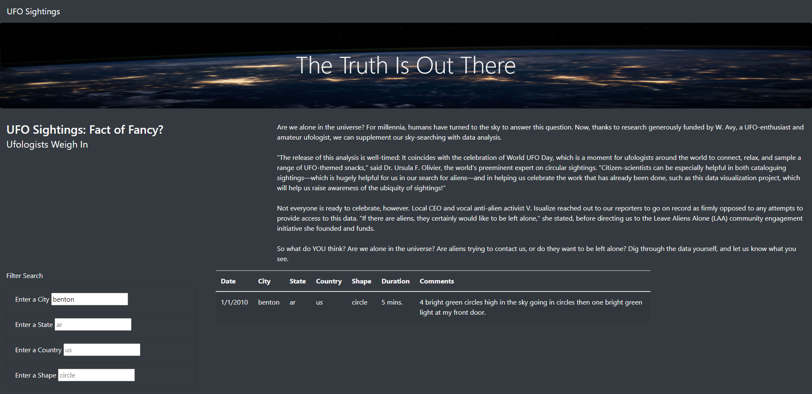

# UFOs

## Overview of Project

The purpose of this project is to help Dana provide more filters for the users on her dynamic table in the UFO webpage. We will help her add the addition of the city, state, country and shape filters. This will allow users of her webpage to filter more percise UFO findings depending on their own interests.

## Results

When a user enters the webpage, they are presented with 4 new filters (i.e. city, state, country and shape) and the entire table of UFO sightings for them to look through. If the user is curious about a particular sighting in a city, state, country or even the shape of the UFO, the user is free to enter which ever criteria they would like to explore to each filter. And with the press of the 'enter' key on the keyboard, the table will be filtered and will present all the findings that suit the users' filters. The screenshot below will be an example of the filtering process.
 

 
As we can see on the screenshot above, the user entered 'benton' to the filter for cities and only sightings in that particular town was presented for the users.

## Summary
One drawback of this webpage design is that there are no photo/video evidence to prove the UFO sightings are legitimate. A recommendation for further development is to add an addition column on the table to provide pictures or videos of the UFO findings to allow users to dictate whether the sighting is legitimate. Another recommendation for further development is to allow users to add their own UFO sightings into the table with additional evidence. This will allow our dataset of UFO sightings to increase and allow better analysis on whether UFOs are real.
